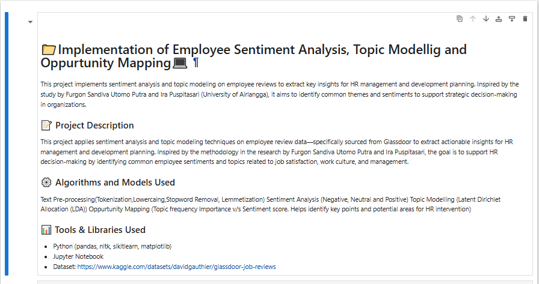
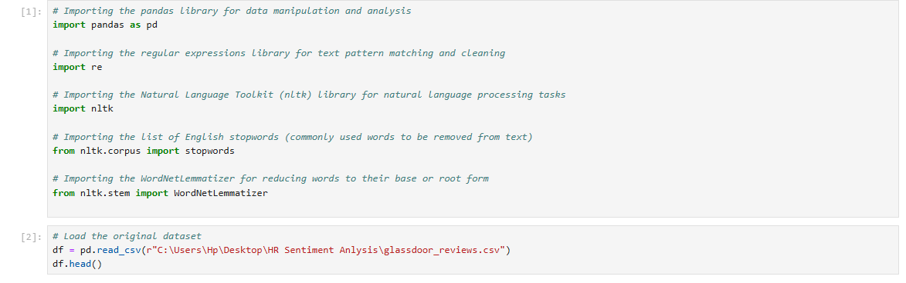
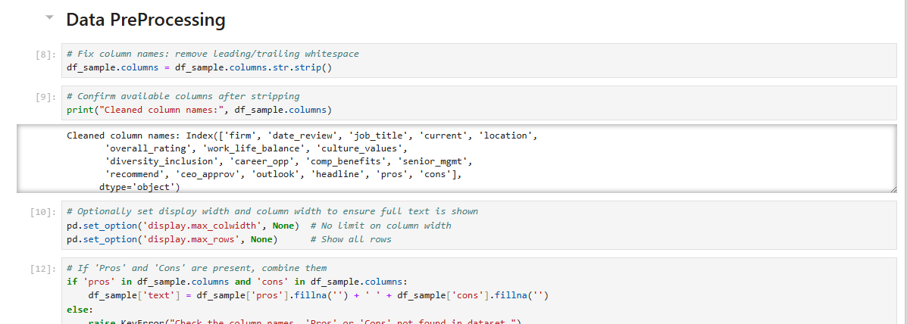
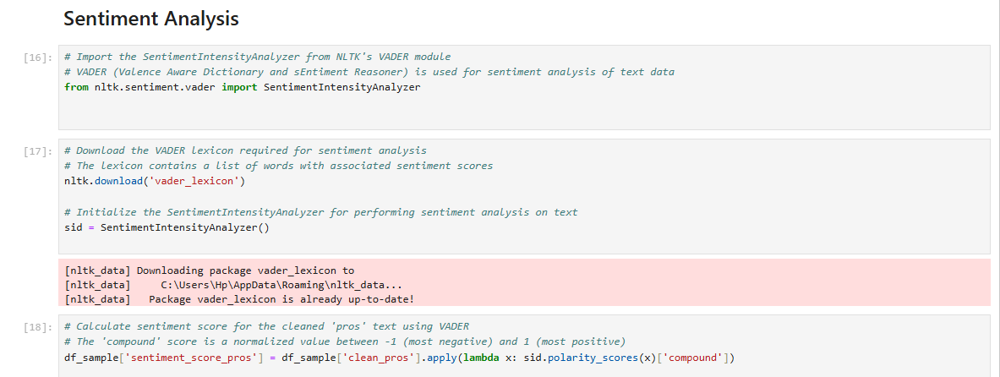
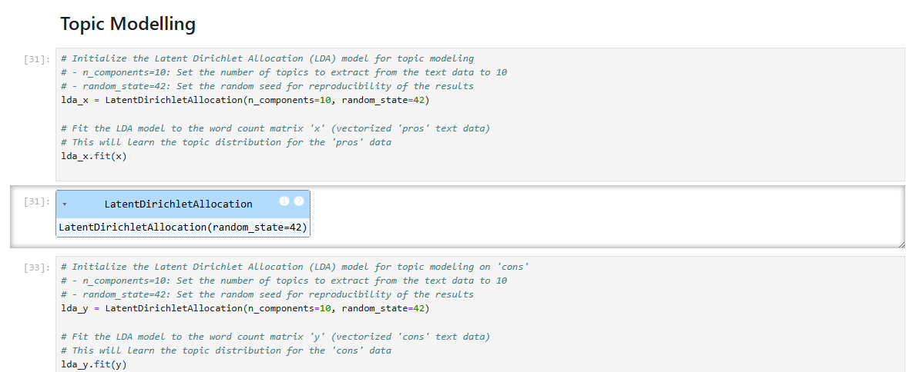
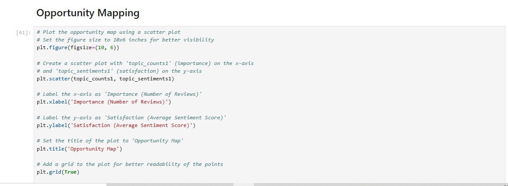

# Employee-Sentiment-Analysis-Topic-Modeling-and-Opportunity-Mapping
Developed an NLP-based Employee Sentiment Analysis solution using Python, VADER, and LDA Topic Modeling to analyze 10,000 Glassdoor reviews. Identified employee sentiment trends, key workplace themes, and improvement opportunities through data-driven insights.

# Employee Sentiment Analysis, Topic Modeling & Opportunity Mapping

## Tools Used

Python, Pandas, NLTK, VADER, LDA Topic Modeling, NLP, Data Visualization, Jupyter Notebook

## Project Overview

1. Analyzed employee reviews and feedback from Glassdoor using Natural Language Processing (NLP) techniques to understand employee sentiment and workplace experiences.
2. Applied VADER sentiment analysis on a sample of 10,000 employee reviews, achieving 84% sentiment classification accuracy across positive, negative, and neutral feedback.
3. Performed Topic Modeling using Latent Dirichlet Allocation (LDA) to identify key themes such as Work-Life Balance, Leadership, Compensation, Career Growth, and Workplace Culture.
4. Mapped sentiment scores across departments and review categories to uncover employee concerns, highlight improvement opportunities, and support data-driven HR decision-making.
5. Generated actionable insights through sentiment trends, topic distributions, and opportunity mapping to help organizations enhance employee experience and retention strategies.
6. Strengthened skills in Natural Language Processing (NLP), Text Analytics, Sentiment Analysis, Topic Modeling, Python, and HR Analytics.

   ## Dashboard Screenshots

### Employee Sentiment Analysis Overview

### Sentiment Analysis Dashboard

### Employee Review Insights

### Topic Modeling Results

### Opportunity Mapping Analysis

### Key Findings & Recommendations

